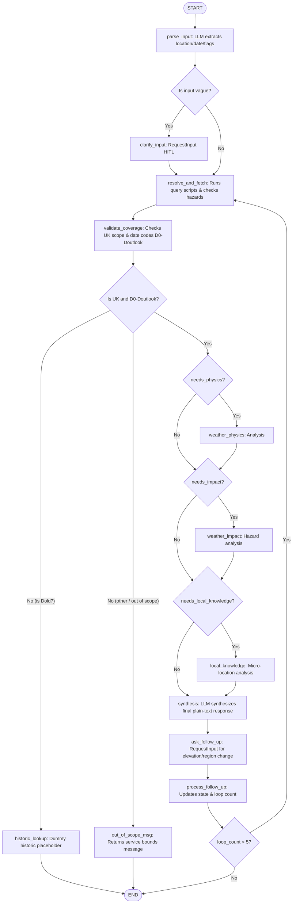

# ADK 2.0 Graph Workflow Documentation - MWIS Weather Agent

This document explains the runtime architecture, node actions, and state transitions of the MWIS weather agent backend.

---

## 1. Graph Visualization

---

## 2. Graph Node Specifications

### Node 1: `parse_input`
* **Type:** `LlmAgent` (model: `gemini-2.5-flash`)
* **Behavior:** Extracts `location` and `date` parameters, and evaluates whether the query requires `needs_physics`, `needs_impact`, or `needs_local_knowledge` annotations.

### Node 2: `clarify_input`
* **Type:** `RequestInput` (HITL interruption)
* **Behavior:** Suspends workflow execution to request the location or date from the user if missing or ambiguous in `parse_input`.

### Node 3: `resolve_and_fetch`
* **Type:** `FunctionNode` (determinstic Python code)
* **Behavior:**
  * Resolves `location` and `date` using the relocated modules in `app/skills/mwis-website/`.
  * Fetches the corresponding forecast from the local caching layer.
  * Scans forecast values: if wind speed is >40mph or temperature is <-5°C, sets `needs_impact = True`.

### Node 4: `validate_coverage`
* **Type:** `FunctionNode`
* **Behavior:** Verifies if the location lies within the 10 UK mountain areas and the date code matches `D0` to `Doutlook`.
  * Routes to `historic_lookup` if date is `Dold`.
  * Routes to `out_of_scope_msg` if out of UK boundaries or beyond the outlook range.
  * Routes to the analysis pipeline (`check_physics`) if fully valid.

### Node 5: `historic_lookup`
* **Type:** `FunctionNode` (placeholder)
* **Behavior:** Outputs the out-of-scope boundaries message.

### Node 6: `out_of_scope_msg`
* **Type:** `FunctionNode`
* **Behavior:** Returns: *"This interactive service only provides forecasts for our 10 mountain areas in the UK over the next week."*

### Nodes 7-9: Pass-Through Analysis Nodes
* **`weather_physics`:** Pass-through.
* **`weather_impact`:** Pass-through.
* **`local_knowledge`:** Pass-through.

### Node 10: `synthesis`
* **Type:** `LlmAgent` (model: `gemini-2.5-flash`)
* **Behavior:** Reads forecast context and annotations to generate a clean, plain-text response answering the query.

### Node 11: `ask_follow_up`
* **Type:** `RequestInput`
* **Behavior:** Prompts the user: *"Do you want to estimate conditions higher/lower on the mountain, or in a specific part of the forecast region?"*

### Node 12: `process_follow_up`
* **Type:** `FunctionNode`
* **Behavior:** Increments `loop_count` (capped at 5) and parses follow-up parameters to determine routing flags for the next loop run.
