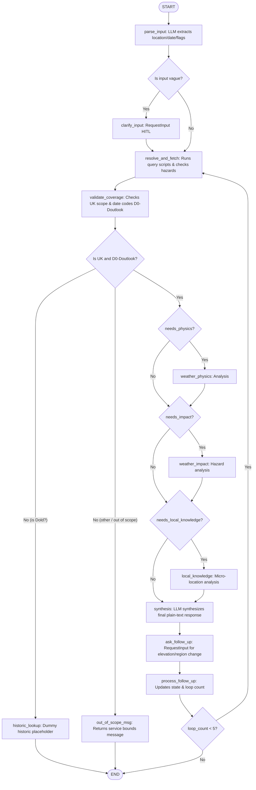

# Specification: ADK 2.0 Graph Workflow for MWIS Weather Agent

This spec defines the graph topology, node configurations, state management, and loopback routing rules for the MWIS weather forecast agent.

```yaml
spec_version: "2.0"
agent_framework: "google-adk>=2.0.0a0"
model: "gemini-2.5-flash"
output_type: "plain-text"
```

---

### SECTION 1: SPEC

**One-line purpose**
Provides interactive mountain weather forecast synthesis and elevation/region adjustment loopbacks using an ADK 2.0 Graph Workflow.

**Users and use cases**
* As a hiker, I want to ask about weather forecasts in a specific UK mountain area so that I can plan my outing.
* As an active user, I want to ask follow-up questions to estimate conditions higher/lower or in a specific sub-region so that I can adapt my route safely.

**Requirements**
1. **Inputs:** Accepts free-text user query.
2. **Ambiguity Handling:** Suspends execution using `RequestInput` if location or date is ambiguous, prompting the user for clarification.
3. **Data Fetching:** Programmatically invokes the 4 `mwis-website` scripts to parse forecast HTML and inject D-codes.
4. **Caching Layer:** The backend caching layer is implemented via the `check_forecast_issued` skill and the `sqlite3` database to store the 10 MWIS forecasts. The front end will have no memory layer.
5. **Conditional Routing:**
   * Run `weather_physics` if `needs_physics` is set (triggered by queries on elevation, temperature gradients, or physical causes).
   * Run `weather_impact` if `needs_impact` is set (triggered by questions on safety, hiking plans, or presence of significant hazards like high winds/heavy rain).
   * Run `local_knowledge` if `needs_local_knowledge` is set (triggered by questions on specific micro-locations).
6. **Synthesis:** Synthesizes final output in plain text.
7. **Follow-Up Loop:** Prompts the user with follow-up options ("higher or lower?", "specific part of the region?") using `RequestInput` and loops back to execute the corresponding nodes.

**Edge cases & expected behavior**
* *No Location/Date:* Suspend and ask user.
* *Out of Scope / Invalid:* If the location is outside the UK or the date is not between D0 and Doutlook, return a service limits message. If date is Dold, route to a historic lookup placeholder.
* *Hazard Detection:* If forecast data contains winds > 40mph or temperatures < -5°C, dynamically override `needs_impact = True`.
* *Infinite Loops:* Cap loopback iterations at 5 to prevent DoS.

**Acceptance criteria**
```
Given a query "What is the weather like on Ben Nevis today?"
When execution starts
Then the workflow parses "Ben Nevis" and "today", fetches the West Highlands forecast, and outputs a plain-text synthesis.

Given a vague query "Is it going to rain?"
When execution starts
Then the workflow suspends at clarify_input prompting for a location.

Given a completed synthesis
When the workflow prompts for a follow-up
Then it suspends at ask_follow_up waiting for user feedback.
```

---

### SECTION 2: PLAN

**Stack and architecture**
* ADK 2.0 `Workflow` graph containing:
  * `parse_input` (LLM node)
  * `clarify_input` (RequestInput node)
  * `resolve_and_fetch` (Function node calling imported Python modules and checking cache)
  * `validate_coverage` (Function node checking geographical and date limits)
  * `historic_lookup` (Function node dummy historic lookup placeholder)
  * `out_of_scope_msg` (Function node returning service limit message)
  * `weather_physics` (Pass-through Function node)
  * `weather_impact` (Pass-through Function node)
  * `local_knowledge` (Pass-through Function node)
  * `synthesis` (LLM node)
  * `ask_follow_up` (RequestInput node)
  * `process_follow_up` (Function node)
* State Schema: `WorkflowState` Pydantic model.

**Mermaid Graph Topology**


**API contracts**
* `WorkflowState`:
  ```python
  class WorkflowState(BaseModel):
      raw_query: str
      location: Optional[str] = None
      date: Optional[str] = None
      region_code: Optional[str] = None
      forecast_data: Optional[dict] = None
      needs_physics: bool = False
      needs_impact: bool = False
      needs_local_knowledge: bool = False
      loop_count: int = 0
  ```

**Testing strategy**
* Eval dataset under `mwis-agent/tests/` evaluating location/date extraction and synthesis accuracy.

---

### SECTION 3: TASKS

## Task 1: Define State Schema and Nodes
* **What to build:** Implement `WorkflowState` and define the graph node functions inside `mwis-agent/app/agent.py`.
* **Files likely affected:** `mwis-agent/app/agent.py`
* **Acceptance criteria:** Code compiles, node functions match parameter signature guidelines.
* **Dependencies:** none

## Task 2: Assemble Workflow Graph and Routing
* **What to build:** Construct the `Workflow` graph using the edges list and conditional routers. Implement the `RequestInput` follow-up loop.
* **Files likely affected:** `mwis-agent/app/agent.py`
* **Acceptance criteria:** Workflow builds, `agents-cli playground` launches successfully.
* **Dependencies:** Task 1

---

## Assumptions to review

1. [ASSUMPTION: The python packages path is configured correctly to import the relocated modules in app/skills/] — Impact: HIGH
2. [ASSUMPTION: Capping follow-up iterations at 5 is acceptable to prevent DoS] — Impact: MEDIUM
