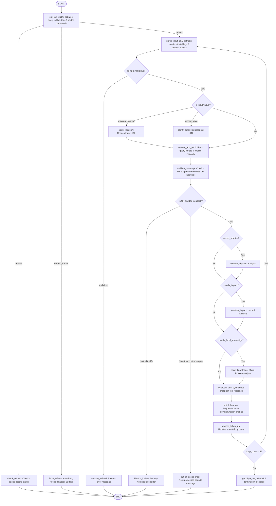

# Specification: ADK 2.0 Graph Workflow for MWIS Weather Agent

This spec defines the graph topology, node configurations, state management, and loopback routing rules for the MWIS weather forecast agent.

```yaml
spec_version: "2.1"
agent_framework: "google-adk>=2.0.0a0"
model: "gemini-2.5-flash"
output_type: "plain-text"
```

---

### SECTION 1: SPEC

**One-line purpose**
Provides interactive mountain weather forecast synthesis, resolving missing inputs gracefully, offering multi-region comparison (max 5 regions), and handling elevation/region adjustment loopbacks using an ADK 2.0 Graph Workflow.

**Users and use cases**
* As a hiker, I want to ask about weather forecasts in a specific UK mountain area so that I can plan my outing.
* As an active user, I want to ask follow-up questions to estimate conditions higher/lower or in a specific sub-region so that I can adapt my route safely.
* As an ADK user, I want the agent to ask me to clarify the date if I don't provide one, so that I don't accidentally receive a forecast for the wrong day.
* As an ADK user, I want the agent to ask me to clarify the location if I don't provide one, and offer a regional comparison so I can find the best weather across multiple areas.
* As an ADK user, I want to request a comparison of up to 5 explicit forecasts I choose.

**Requirements**
1. **Inputs:** Accepts free-text user query. The agent must parse and extract any relative dates (e.g. 'today', 'tomorrow', 'Saturday') or absolute dates (e.g. '11/07/2026', '11th July') in the user input. Additionally, the agent must parse and extract any potential geographical locations, including specific mountain peaks/hills (e.g. "Ben Nevis", "Snowdon", "Scafell Pike"), valleys, towns, country names (e.g. "Scotland"), regions, or national parks mentioned in the query.
2. **Ambiguity Handling:** Suspends execution using `RequestInput` if location or date is completely missing or ambiguous, prompting the user for clarification.
3. **Data Fetching:** Programmatically invokes the `mwis-website` scripts to parse forecast HTML and inject D-codes. It must support fetching up to 5 regions concurrently.
4. **Caching Layer:** The backend caching layer is implemented via the `check_forecast_issued` skill and the `sqlite3` database to store the 10 MWIS forecasts. The front end will have no memory layer.
5. **Conditional Routing:**
   * Run `weather_physics` if `needs_physics` is set (triggered by queries on elevation, temperature gradients, or physical causes).
   * Run `weather_impact` if `needs_impact` is set (triggered by questions on safety, hiking plans, or presence of significant hazards like high winds/heavy rain).
   * Run `local_knowledge` if `needs_local_knowledge` is set (triggered by questions on specific micro-locations).
6. **Synthesis:** Synthesizes final output in plain text. If specific date codes (like `D0`, `D1`, or `Doutlook`) are resolved and present in the state under `resolved_date_codes`, the synthesized text must only contain the forecast for those specific days or outlook, omitting any other days or general outlook. If the list is empty (e.g., when the user requests "full forecast" or specifies no date restrictions), no filtering will occur and the complete forecast payload (all 3 days and the outlook) will be returned. Additionally, if the user's query targets one or more specific weather categories in `extracted_categories` (such as 'cloud', 'wind', etc.), the synthesis node must describe those specific weather elements first in the response, before summarizing or mentioning the other details.
7. **Follow-Up Loop:** Prompts the user with follow-up options ("higher or lower?", "specific part of the region?") using `RequestInput` and loops back to execute the corresponding nodes.
8. **Cache Refresh Commands:** When triggering a check refresh or force refresh, the nodes must read the `USE_LIVE_FORECAST` environment variable to determine if updates are live or mock.

**Edge cases & expected behavior**
* *No Location:* Suspend and yield `RequestInput` offering a comparison of up to 5 regions or a specific location.
* *No Date:* Suspend and yield `RequestInput` asking for specific date or 3-day outlook.
* *User requests >5 explicit regions:* Suspend and yield `RequestInput` reminding them of the 5-region cap and asking them to choose exactly which regions they want (Reminder: Scotland has 5, England has 3, Wales has 2).
* *LLM parser omits optional fields:* Pydantic `ParseOutput` must correctly default `date` to `None` without raising a `ValidationError`.
* *Out of Scope / Invalid:* If the location is outside the UK, or fails to resolve to a known region (maps to "Unknown"), or the date is not between D0 and Doutlook, return a service limits message. If date is Dold, route to a historic lookup placeholder.
* *Mock Forecast Environments:* In local dev, `MWIS_ENV=development` will dynamically align mock forecast dates to the current execution date to ensure they are treated as "fresh". `MWIS_ENV=test-new-dcode` will intentionally misalign dates to force a `"Dold"` (stale) scenario for testing.
* *Hazard Detection:* If forecast data contains winds > 40mph or temperatures < -5°C, dynamically override `needs_impact = True`.
* *Infinite Loops:* Cap loopback iterations at 5 to prevent DoS.

**Acceptance criteria**
```
Given a query "What is the weather like on Ben Nevis today?"
When execution starts
Then the workflow parses "Ben Nevis" and "today", fetches the West Highlands forecast, and outputs a plain-text synthesis.

Given a vague query "Is it going to rain?"
When execution starts
Then the workflow suspends at clarify_location prompting for a location.

Given a vague query "What is the weather on Ben Nevis?" (no date)
When execution starts
Then the workflow suspends at clarify_date prompting for a date.

Given a query "Compare all areas"
When execution starts
Then the workflow suspends at clarify_location stating "Only 5 regions can be compared. Which regions do you wish to choose?"

Given a query "What is weather on Ben Nevis today and tomorrow?"
When execution starts
Then the workflow parses "Ben Nevis" and date codes "D0" and "D1", and the output forecast payload contains only D0 and D1 details.

Given a query "What is weather on Ben Nevis next week?"
When execution starts
Then the workflow parses "Ben Nevis" and date code "Doutlook", and the output forecast payload contains only the outlook section.

Given a query "What is the full weather forecast on Ben Nevis?"
When execution starts
Then the workflow parses "Ben Nevis" with no date code restrictions, and the output forecast payload contains all 3 days and the outlook.

Given a multi-turn conversation where Turn 1 is "How cold is it in West Highlands today?" and Turn 2 is "Is it raining?"
When Turn 2 execution starts
Then the agent retains the location "West Highlands" and date "today" (D0) from context, and switches the category to "wet" to prioritize precipitation details.

Given a multi-turn conversation where Turn 1 is "Is it cloudy in West Highlands today?" and Turn 2 is "what about Brecon Beacons?"
When Turn 2 execution starts
Then the agent retains the date "today" (D0) and the category "cloud" from context, and updates the location to "Brecon Beacons".

Given a multi-turn conversation where Turn 1 is "Is it cloudy in West Highlands today?" and Turn 2 is "what about the following day?"
When Turn 2 execution starts
Then the agent retains the location "West Highlands" and category "cloud", and resolves "following day" by shifting the date from D0 to D1.

Given a multi-turn conversation where Turn 1 is "Is it cloudy in West Highlands today?" and Turn 2 is "reset Snowdonia tomorrow"
When Turn 2 execution starts
Then the agent flags a new query context (is_new_query=True) because of the explicit "reset" keyword, clears the previous memory, and resolves the location Snowdonia and date tomorrow (D1).

Given a multi-turn conversation where Turn 1 is "Ben Nevis Cloud tomorrow" and Turn 2 is "And for Cairngorm?"
When Turn 2 execution starts
Then the agent does not flag a new query context (is_new_query=False) because there are no explicit reset keywords, retains the date "tomorrow" (D1) and category "cloud" from context, and only updates the location to Cairngorms.
```

---

### SECTION 2: PLAN

**Stack and architecture**
* ADK 2.0 `Workflow` graph containing:
  * `parse_input` (LLM node)
  * `clarify_location` (RequestInput node)
  * `clarify_date` (RequestInput node)
  * `resolve_and_fetch` (Function node calling imported Python modules and `query_countries.py` logic)
  * `validate_coverage` (Function node checking geographical and date limits)
  * `historic_lookup` (Function node dummy historic lookup placeholder)
  * `out_of_scope_msg` (Function node returning service limit message)
  * `weather_physics` (Pass-through Function node)
  * `weather_impact` (Pass-through Function node)
  * `local_knowledge` (Pass-through Function node)
  * `synthesis` (LLM node)
  * `ask_follow_up` (RequestInput node)
  * `process_follow_up` (Function node)
* State Schema: `WorkflowState` Pydantic model.

**Mermaid Graph Topology**


**API contracts**
* `WorkflowState`:
  ```python
  class WorkflowState(BaseModel):
      raw_query: str
      locations: list[str] = Field(default_factory=list) # Replaces location
      date: Optional[str] = None
      resolved_date_codes: list[str] = Field(default_factory=list) # Track resolved date codes (e.g. D0, D1)
      region_codes: list[str] = Field(default_factory=list) # Replaces region_code
      forecast_data: Optional[dict] = None
      needs_physics: bool = False
      needs_impact: bool = False
      needs_local_knowledge: bool = False
      is_malicious: bool = False
      awaiting_refresh_force: bool = False
      loop_count: int = 0
  ```
* `ParseOutput` must correctly specify `default=None` and `default=False` across all fields, and include `is_malicious: bool = False` and `is_new_query: bool = False`.

**Testing strategy**
* Eval dataset under `mwis-agent/tests/` evaluating location/date extraction and synthesis accuracy.
* Unit tests validating `check_ambiguity` routing to `missing_location` and `missing_date`.
* Curl integration test under `tests/integration/test_human_agent_interaction.py` starting the dev server and sending a `curl -X POST` request for today's forecast to verify "Outlook:" section is excluded from the text output.

---

### SECTION 3: TASKS

## Task 1: Define State Schema and Nodes
* **What to build:** Implement `WorkflowState` (with `locations` array) and `ParseOutput` Pydantic models. Fix schema default bugs.
* **Files likely affected:** `mwis-agent/app/agent.py`
* **Acceptance criteria:** Code compiles, instantiating `ParseOutput()` without arguments succeeds.
* **Dependencies:** none

## Task 2: Implement Ambiguity Routing & Clarification Nodes
* **What to build:** Construct the `clarify_location` and `clarify_date` `RequestInput` nodes. Implement `check_ambiguity` to route appropriately. Handle >5 region prompts.
* **Files likely affected:** `mwis-agent/app/agent.py`
* **Acceptance criteria:** Missing inputs hit the correct clarification nodes instead of crashing.
* **Dependencies:** Task 1

## Task 3: Assemble Workflow Graph and Routing
* **What to build:** Construct the `Workflow` graph using the edges list and conditional routers. Integrate `resolve_and_fetch` with `query_countries.py` logic and `asyncio.gather`.
* **Files likely affected:** `mwis-agent/app/agent.py`
* **Acceptance criteria:** Workflow builds, `agents-cli playground` launches successfully and correctly parses/aggregates up to 5 forecasts.
* **Dependencies:** Task 2

## Task 4: Prompt Injection Security Layer
* **What to build:** Implement the `<user_input>` XML isolation in `set_raw_query`. Update `parse_input` instruction to reject system commands and set `is_malicious=True`. Add `check_security` router and `security_refusal` terminal node.
* **Files likely affected:** `mwis-agent/app/agent.py`, `mwis-agent/app/agent_nodes.py`, `mwis-agent/app/agent_logic.py`, `mwis-agent/app/agent_state.py`
* **Acceptance criteria:** Malicious prompts injected into the system are caught by `parse_input`, routed to `security_refusal`, and safely rejected without calling MWIS.
* **Dependencies:** Task 1, Task 2, Task 3

---

## Assumptions to review

1. [ASSUMPTION: We check location ambiguity before date ambiguity in routing] — Impact: MEDIUM
2. [ASSUMPTION: Capping follow-up iterations at 5 is acceptable to prevent DoS] — Impact: MEDIUM
