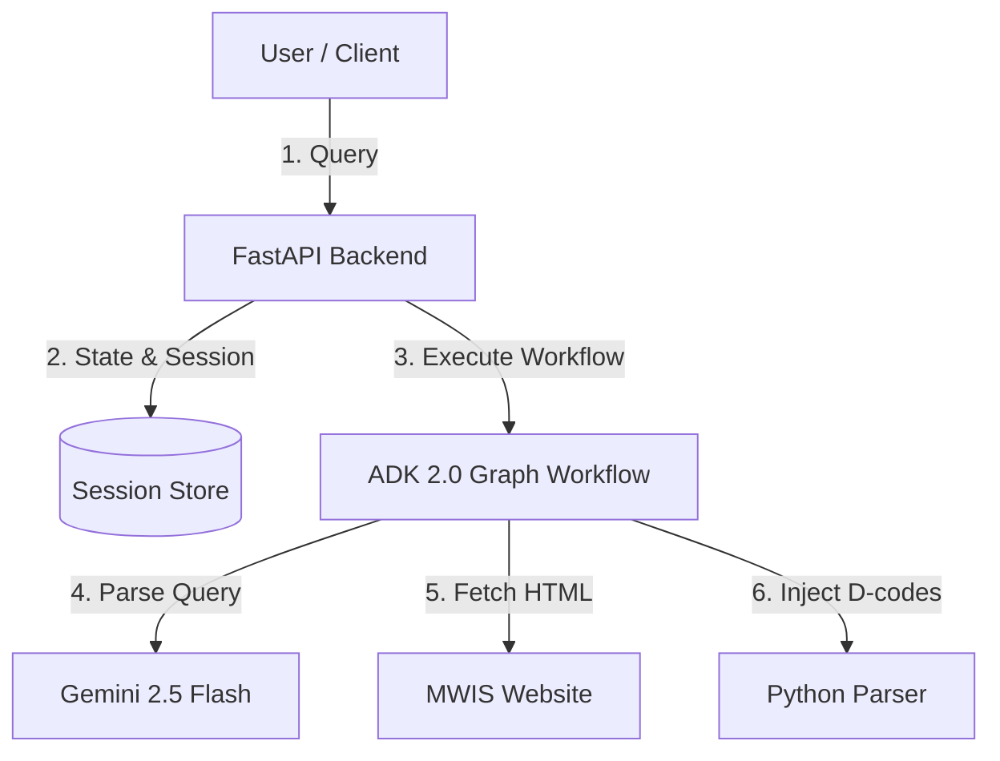

# STRIDE Threat Modeling Assessment - ADK 2.0 Graph Workflow

This document outlines the security threat model for the Mountain Weather Information Service (MWIS) agent backend, utilizing the STRIDE methodology.

---

## 1. System Boundaries & Data Flow

---

## 2. STRIDE Assessment

### Spoofing (Identity Spoofing)
* **Threat**: An unauthorized user calls the backend API mimicking an authenticated developer or client session.
* **Mitigation**:
  * Enforce standard token-based authentication on all user-facing FastAPI endpoints.
  * Restrict access to the ADK `playground` route to local development environments only.

### Tampering (Data/State Tampering)
* **Threat**:
  * **Parameter Injection**: Users manipulate location or date parameters to cause directory traversal or arbitrary file parsing.
  * **Prompt Injection**: Users embed system instructions in their queries to hijack the LLM nodes.
  * **Session State Hijacking**: Users manipulate suspended session state IDs to access or modify other users' active workflows.
* **Mitigation**:
  * Strict regex and Pydantic validation on all input fields (location name, date format, region codes).
  * Use custom tags (`<user_input>`) and prompt-isolation guidelines in all LLM node system prompts.
  * Securely generate and cryptographically verify all workflow session IDs.

### Repudiation
* **Threat**: A user performs malicious actions or triggers high billing charges, but the backend lacks logs to audit the source.
* **Mitigation**:
  * Log all inbound queries, state transitions, API key usages, and execution errors with timestamped session tracking.
  * Avoid logging any PII or raw API keys in audit logs.

### Information Disclosure
* **Threat**:
  * Exposure of private environment credentials (`GEMINI_API_KEY`, GCP service account keys).
  * Backend stack traces exposing directory structures or internal prompts in error responses.
* **Mitigation**:
  * Force `.env` exclusion in `.gitignore`.
  * Return generalized user-facing error messages while logging the detailed trace internally.

### Denial of Service (DoS)
* **Threat**:
  * Users spam expensive LLM synthesis calls or trigger infinite graph execution loops (using the interactive loopback feedback).
  * Users feed extremely long inputs to cause memory exhaustion.
* **Mitigation**:
  * Set max length limits (e.g. 100 characters) on all string inputs.
  * Set a workflow-level execution timeout (`timeout` parameter in `Workflow`).
  * Enforce maximum iteration bounds on the workflow loopback edge to prevent infinite cycles.
  * Implement rate-limiting on FastAPI query endpoints.

### Elevation of Privilege
* **Threat**: An unauthenticated user bypasses normal API flow to trigger privileged tool/script executions.
* **Mitigation**:
  * Restrict workflow permissions. The graph nodes must run under low-privilege runtime credentials with no write access to system directories.
  * Strictly isolate all parser/injector scripts from shell execution environments.
